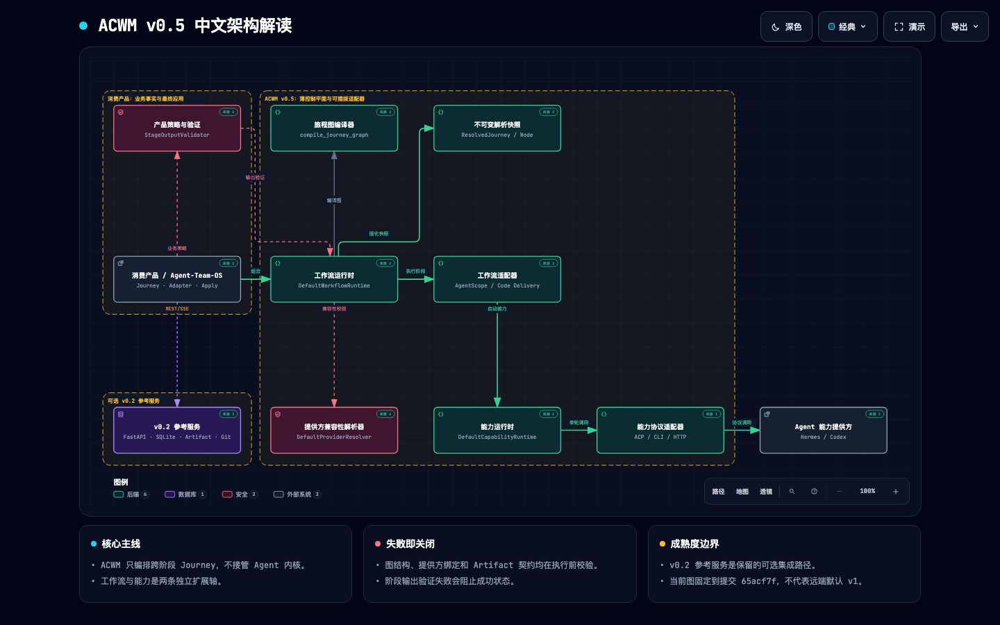

# Agent Capability–Workflow Matrix：中文架构图

[返回主 README](README.md)

## ACWM v0.5 架构解读

> 图基于提交 `65acf7f`。中文名称用于架构解读，代码中的类名、协议名和配置标识保持不变。

## 节点与代码标识

| 中文节点 | 代码标识 | 主要职责 |
| --- | --- | --- |
| 产品策略与验证 | `StageOutputValidator` | 管理业务事实、权限、Artifact 策略和最终 Apply |
| 消费产品 | Agent-Team-OS / consuming product | 定义 Journey、组合 Adapter、决定最终副作用 |
| 旅程图编译器 | `compile_journey_graph` | 校验 DAG、Gate 和有限 Loop，生成确定性指纹 |
| 工作流运行时 | `DefaultWorkflowRuntime` | 解析 Journey 并执行跨 Stage 控制 |
| 提供方兼容性解析器 | `DefaultProviderResolver` | 校验 Slot、Provider 和 Artifact 契约 |
| 不可变解析快照 | `ResolvedJourney` / `ResolvedNode` | 固化版本、绑定关系与内容指纹 |
| 工作流适配器 | `WorkflowAdapter` | 承载 AgentScope、Code Delivery 等 Stage 内语义 |
| 能力运行时 | `DefaultCapabilityRuntime` | 提供 `resolve → stage → signal` 运行时接口 |
| 能力协议适配器 | Hermes ACP / Codex CLI / HTTP sync | 翻译外部 Agent 协议与事件 |
| Agent 能力提供方 | Hermes / Codex | 拥有 Agent loop、工具与私有状态 |
| v0.2 参考服务 | FastAPI / SQLite / Artifact Store / Git worktree | 提供可选的回归与集成路径 |

## 阅读要点

- ACWM 管理跨 Stage Journey，不接管 Agent 内核、Memory 或 Session。
- Workflow 与 Capability 是两条可独立扩展的轴。
- 图结构、Provider 绑定、Artifact 契约和 Stage 输出采用 fail-closed 校验。
- v0.2 Reference Server 是保留的可选集成路径，不代表 v0.5 Core 的必选依赖。
