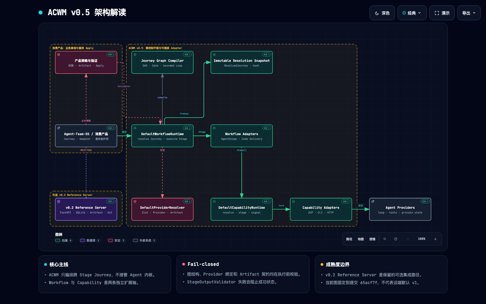

# Agent Capability–Workflow Matrix

[中文节点版架构图](README-CN.md)

ACWM 是面向应用层长程任务的薄控制平面。它把 Agent 的深度能力与 Agent 参与的工作制度分离，让一个 Journey 可以跨越 AgentScope、Direct、LangGraph 等不同 Workflow Mode，同时保持可恢复、可审批和可审计。

```text
Agent-Team-OS / consuming product
  └─ ACWM Journey Graph: Stage / Gate / bounded Loop
       ├─ AgentScope Workflow -> Hermes Capability
       └─ Code Delivery Workflow -> Codex Capability
```

ACWM 不提供另一套 Agent、Memory、Session、Sandbox 或部署平台。Stage 内部的消息、拓扑、会话和 Checkpoint 属于 Workflow Adapter；Hermes/Codex 的循环、工具和私有记忆属于 Capability Adapter；产品拥有业务事实、Artifact 正文和最终 Apply。

## 架构总览



> 图基于提交 `65acf7f`，展示 v0.5 Core、可插拔 Adapter、
> 消费产品边界及可选的 v0.2 Reference Server。

## v0.5.1 核心能力

- schema v4 外层 DAG `Journey -> Stage | Gate | Loop`；一个 Stage 支持多个具名 Capability Binding。
- DAG 支持 fork/join 和条件策略引用；拓扑编译生成确定性顺序、入口、出口与 SHA-256。
- Loop 是显式有限子图，必须配置退出条件、最大轮次、超时与耗尽动作；任意回边被拒绝。
- schema v3 线性 `steps` 继续读取并规范化为单路径 DAG。
- `WorkflowManifest` 声明 Binding Slot 和 Feature 要求，配置不能伪造能力。
- `ResolvedWorkflow`、`ResolvedStage`、`ResolvedNode` 固化版本与指纹。
- Stage 可声明跨 Workflow 输入 `ArtifactContract`；编译结果按 canonical Stage Path
  冻结契约内容 SHA-256，Provider Resolution 必须验证每个绑定 Provider 的输入兼容性。
- `CapabilityRuntime` 与 `DefaultWorkflowRuntime` 两条独立扩展轴。
- `CapabilityPolicy` 可分别控制 Read/Search/Fetch、Workspace Edit 与 Command Allowlist；Hermes ACP
  在调用产品 Permission Broker 前先解析 `allow | ask | deny`，显式 `deny` 不得降级成人工批准。
- 带哈希的 `HandoffEnvelope` 与通用 `GateSubject`。
- 产品可注入 `StageOutputValidator`，失败时阻止 Stage 成功。
- `agentscope.role-turn`、`code-delivery`、Hermes ACP、Codex CLI、HTTP sync 参考 Adapter。
- Core 延迟加载所有可选集成；导入 Core 不需要 AgentScope、LangGraph、FastAPI、ACP 或 HTTPX。

详细边界见 [RFC-0003](docs/architecture/RFC-0003-THIN-ACWM-CONTROL-PLANE.md)、
[ADR-0003](docs/architecture/ADR-0003-THIN-CONTROL-PLANE.md) 和
[ADR-0006](docs/architecture/ADR-0006-STAGE-INPUT-ARTIFACT-CONTRACTS.md)。

## 安装与验证

ACWM 需要 Python 3.11 或 3.12，推荐使用 uv。

```bash
uv sync --extra dev
uv run ruff check .
uv run mypy
uv run pytest
```

最小 Core 安装只包含 Pydantic 与 PyYAML。按需选择 Extras：

```bash
pip install 'agent-capability-workflow-matrix[agentscope]'
pip install 'agent-capability-workflow-matrix[acp]'
pip install 'agent-capability-workflow-matrix[langgraph]'
pip install 'agent-capability-workflow-matrix[server]'
```

已配置本机 Hermes 时可运行真实 ACP smoke test：

```bash
ACWM_REAL_HERMES=1 uv run pytest tests/integration/test_real_hermes_acp.py
```

## 最小组合示例

```python
from acwm.adapters.agentscope_role_turn import AgentScopeRoleTurnAdapter
from acwm.adapters.code_delivery import CodeDeliveryWorkflowAdapter
from acwm.application import DefaultWorkflowRuntime

workflow_runtime = DefaultWorkflowRuntime(
    capability_runtime=capability_runtime,
    adapters={
        "agentscope.role-turn": AgentScopeRoleTurnAdapter(),
        "code-delivery": CodeDeliveryWorkflowAdapter(),
    },
    validators={"candidate-security-v1": product_validator},
)

resolved_journey = workflow_runtime.resolve_journey(journey_definition)
```

参考 Journey：

```text
Hermes PM x agentscope.role-turn
-> Hermes Project Admin x agentscope.role-turn
-> approve-plan Gate
-> Codex Backend x code-delivery
-> product validation
-> approve-candidate Gate
```

## v0.2 Reference Server

v0.2 的 FastAPI、SQLite、Git worktree 与 LangGraph 代码交付链暂时保留为可选 Reference Server，用于回归恢复、权限、SSE 和 Artifact 行为。它不再定义 ACWM v0.3 的产品边界。

```bash
uv sync --extra server
uv run acwm serve --data-dir /absolute/path/acwm-data
```

新图定义使用配置 schema v4；schema v3 线性 Journey 保持只读兼容。SQLite 存储 schema 仍为 4，请使用与旧 v0.2 隔离的数据目录。ACWM 不自动 merge、push、创建 PR 或更新产品主分支。

## License

Apache-2.0
