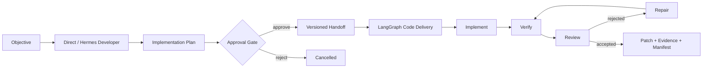

# Agent Capability–Workflow Matrix

ACWM 是一个面向应用层长程任务的 Agent 元调度内核。它把“Agent 拥有什么深度能力”与“Agent 以什么协作制度参与任务”分开；架构目标是让同一个 Capability 未来可进入状态图、会议等不同模式，而不需要重写 Agent 内核。

当前 v1 是一条可运行的纵向验证链：同一个 Hermes Developer Capability 先以 Direct 模式制定计划，通过人工审批后，再进入 LangGraph 的实现、验证、评审与修复循环。



## v1 已实现

- Python 3.11+、uv、FastAPI、SQLite 与 LangGraph。
- 不可变的 Capability、Workflow、Node、Attempt 与 Handoff 契约。
- YAML Capability 注册与固定 v1 Journey Profile；`transport.env` 只允许引用环境变量名。
- Hermes ACP stdio Adapter，支持 mode-scoped Session、cwd、取消、输出和权限决策。
- 隔离 Git worktree；不修改主工作树，不 merge、push 或创建 PR。
- SQLite Event Log、Snapshot、正常完成请求后的幂等响应重放与 SSE `Last-Event-ID` 重放。
- Direct 规划、计划审批、LangGraph 实现/验证/评审/最多两轮修复。
- 重启后保守恢复：失联 Attempt 进入 `interrupted`，resume/retry 创建新 Attempt。
- 内容寻址 Artifact：计划、Handoff、patch、测试证据、交付摘要和 Manifest。

## 快速开始

前置条件：Python 3.11/3.12、uv、Git，以及已完成模型 Provider 认证的 Hermes Agent。标准 Hermes 安装已包含 ACP；精简 pip 环境可安装 `hermes-agent[acp]`。

```bash
pip install 'hermes-agent[acp]'
hermes --version
```

```bash
uv sync --all-extras
uv run pytest
uv run acwm serve \
  --data-dir /absolute/path/outside-target-repository/acwm-data \
  --capabilities config/capabilities.yaml \
  --journeys config/journeys.yaml
```

CI 默认使用确定性 fake ACP。已配置本机 Hermes 模型凭据时，可运行真实 ACP smoke test：

```bash
ACWM_REAL_HERMES=1 uv run pytest tests/integration/test_real_hermes_acp.py
```

默认监听 `127.0.0.1:8787`。绑定非 loopback 地址时必须设置 `ACWM_API_KEY`。

目标必须是至少包含一个 commit 的本地 Git 仓库，`base_ref` 必须能解析为 commit。建议把 `--data-dir` 放在目标仓库之外。

创建 Journey：

```bash
curl -X POST http://127.0.0.1:8787/v1/journeys \
  -H 'Content-Type: application/json' \
  -H 'Idempotency-Key: create-demo-1' \
  -d '{
    "definition_id": "code-delivery-v1",
    "capability_id": "hermes-developer",
    "objective": "为项目增加健康检查端点",
    "repository": {"path": "/absolute/path/to/repo", "base_ref": "HEAD"},
    "verification_commands": [
      {"name": "tests", "argv": ["uv", "run", "pytest"], "timeout_seconds": 600}
    ]
  }'
```

获取 Journey 后，用 Gate 返回的 `revision` 与 `plan_hash` 批准计划：

```bash
curl http://127.0.0.1:8787/v1/journeys/JOURNEY_ID
```

等待状态变为 `awaiting_approval`，从响应的 `gates` 中读取真实的 `id`、`revision` 与 `plan_hash`，再提交审批：

```bash
curl -X POST http://127.0.0.1:8787/v1/journeys/JOURNEY_ID/gates/approve-plan/decisions \
  -H 'Content-Type: application/json' \
  -H 'Idempotency-Key: approve-demo-1' \
  -d '{"decision":"approve","expected_revision":1,"plan_hash":"PLAN_SHA256"}'
```

订阅事件：

```bash
curl -N http://127.0.0.1:8787/v1/journeys/JOURNEY_ID/events
```

绑定非 loopback 时，所有 curl 还需添加 `-H "Authorization: Bearer $ACWM_API_KEY"`。v1 没有清理 API；worktree、`acwm/<journey_id>` 分支和内容寻址 Artifact 会保留以便审计与恢复。Artifact 正文位于本地 `data-dir/artifacts`，API 当前只返回引用。

## 核心边界

- SQLite Event Log 是 Journey 控制面的真相源。
- LangGraph Checkpoint 只负责单个 Workflow Mode 内部的恢复游标。
- Git worktree 是代码产物真相源。
- Hermes 拥有 Agent Loop、Skills、Tools 与 Memory；ACWM 不读写 Hermes 私有数据库。
- 跨模式只通过可验证的 `HandoffEnvelope` 传递上下文，不共享原始对话 Session。
- v1 不承诺 exactly-once；对不确定副作用采用 `needs_attention` 和显式恢复。
- 幂等记录与业务 mutation 不是单一跨组件事务；服务若恰好在 mutation 后、响应记录前崩溃，重试仍可能需要人工 reconciliation。

完整职责、状态机和恢复说明见 [v1 架构设计](docs/architecture/ACWM-V1-ARCHITECTURE.md)。

## 当前不包含

AutoGen、AgentScope、会议/看板/知识库、团队 Agent、LLM 元路由、完整 DAG、跨 Stage 并行、共享长期记忆、A2A/MCP 外部协议、多租户、分布式 Worker、远程沙箱和自动 Git 发布均不属于 v1。

## License

Apache-2.0
